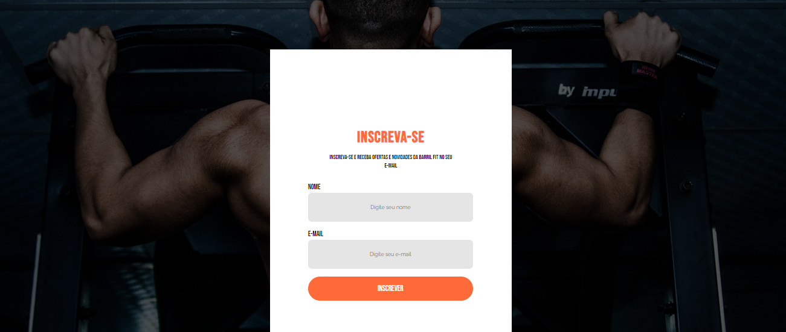

# Barril Fit

O Barril Fit é Sistema de academia desenvolvido em PHP/Laravel. Na fase atual, ele possui Landing Page da academia e permite realizar login e cadastrar treinos para usuários.

## Próximos passos: 

- Criar dashboard para usuários com login
- Aplicar conceitos de SEO
- Aplicar conceitos de UI/UX

## Screenshots:

### Homepage:

### Login:

### Ficha de treino:

